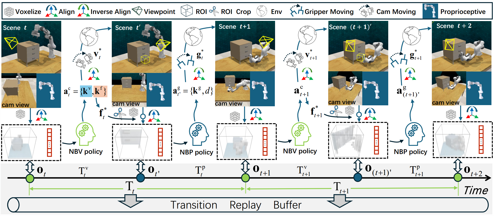

# Observe Then Act: Asynchronous Active Vision-Action Model for Robotic Manipulation (OTA)
This repository provides the official code for the [OTA](https://arxiv.org/abs/2409.14891) paper, including the core OTA model. For more information, please see the [project](https://hymwgk.github.io/ota/) page. More updates are coming soon.



## Installation
- It is recommended to install in a conda virtual environment.
    ```bash
    conda create --name OTA python=3.8
    conda activate OTA
    ```
- OTA uses CoppeliaSim (version 4.1 required by PyRep) as the physics simulator. The code was developed and tested on Ubuntu 20.04.
    - [Ubuntu 16.04](https://www.coppeliarobotics.com/files/V4_1_0/CoppeliaSim_Edu_V4_1_0_Ubuntu16_04.tar.xz)
    - [Ubuntu 18.04](https://www.coppeliarobotics.com/files/V4_1_0/CoppeliaSim_Edu_V4_1_0_Ubuntu18_04.tar.xz)
    - [Ubuntu 20.04](https://www.coppeliarobotics.com/files/V4_1_0/CoppeliaSim_Edu_V4_1_0_Ubuntu20_04.tar.xz)

    Once you have downloaded CoppeliaSim, add the following to your ~/.bashrc file. (NOTE: the 'EDIT ME' in the first line)
    ```bash
    export COPPELIASIM_ROOT=<EDIT ME>/PATH/TO/COPPELIASIM/INSTALL/DIR
    export LD_LIBRARY_PATH=$LD_LIBRARY_PATH:$COPPELIASIM_ROOT
    export QT_QPA_PLATFORM_PLUGIN_PATH=$COPPELIASIM_ROOT
    export DISPLAY=:1.0
    ```

- Install the official PyRep.
    ```bash
    git clone https://github.com/stepjam/PyRep.git
    cd PyRep
    pip install -r requirements.txt
    pip install -e .
    ```
- Install our modified version of RLBench, in which we mainly added a virtual floating camera independent of the existing robotic arm in the original RLBench environment. 
    ```
    git clone https://github.com/RAI-ZZU/RLBench.git
    cd RLBench
    pip install -e .
    ```
- Install our modified version of YARR to support the RLBench simulation environment.
    ```
    git clone https://github.com/RAI-ZZU/YARR.git
    pip install -e .
    ```

- We integrated OTA as a module into the existing [ARM](https://github.com/stepjam/ARM) project, which includes standardized files such as OTA-related configuration parameters. It is recommended to directly install the high-level ARM package, which will clone OTA recursively into the appropriate location.
    ```
    git clone --recurse-submodules https://github.com/RAI-ZZU/ARM.git
    ```

## Running experiments
- The OTA model is trained based on few-shot reinforcement learning, so ensure that the corresponding demos have been generated and saved before training. 
    ```bash
    cd /path_to_rlbench/rlbench/tools
    python dataset_generator.py --save_path=/mnt/my/save/dir --tasks=meat_off_grill --image_size=128,128 --renderer=opengl --episodes_per_task=30 --variations=1 --processes=1

- Run the training script with the default batch size set to 128. Please ensure your GPU has sufficient VRAM. We use a 4*4090 GPU server for training.
    ```bash
    cd /path_to_ARM/ARM/
    python launch.py method=OTA rlbench.task=meat_off_grill rlbench.demo_path=/mnt/my/save/dir rlbench.cameras=[active] framework.gpu=0 
    ```

## Acknowledgement
Our code is based on the selfless contributions of the following repositories. We thank the authors for their open-source efforts.
- [Pyrep](https://github.com/stepjam/PyRep)
- [RLBench](https://github.com/stepjam/RLBench)
- [YARR](https://github.com/stepjam/YARR)
- [ARM](https://github.com/stepjam/ARM)
- [Gradientnbv](https://github.com/akshaykburusa/gradientnbv)

## Citation
```
@article{wang2024observe,
    title={Observe Then Act: Asynchronous Active Vision-Action Model for Robotic Manipulation},
    author={Wang, Guokang and Li, Hang and Zhang, Shuyuan and Liu, Yanhong and Liu, Huaping},
    journal={arXiv preprint arXiv:2409.14891},
    year={2024}
}
```